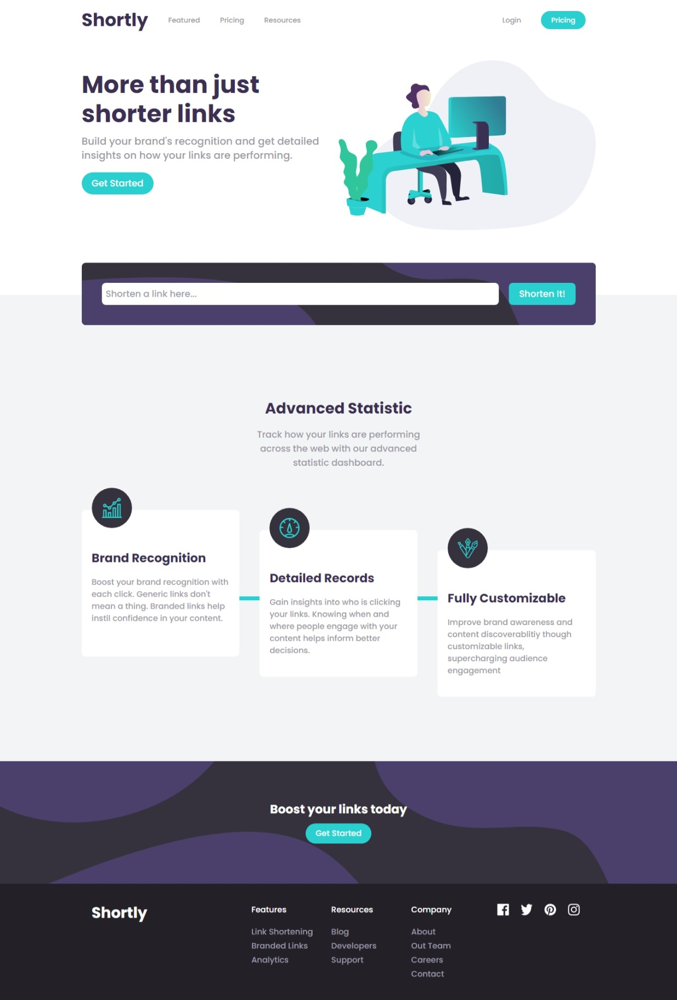
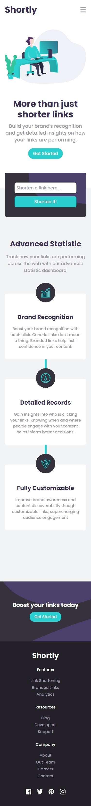

# Frontend Mentor - Shortly URL shortening API Challenge solution

## Table of contents

- [Overview](#overview)
  - [The challenge](#the-challenge)
  - [Screenshot](#screenshot)
  - [Links](#links)
- [My process](#my-process)
  - [Built with](#built-with)
- [Author](#author)

## Overview

### The challenge

The challenge is to build out the landing page, integrate with the [shrtcode API](https://app.shrtco.de/) and get it looking as close to the design as possible.

### Screenshot

### Links

- Live Site URL: [https://shortly-az.netlify.app](https://shortly-az.netlify.app/)

## My process

### Built with

- Mobile-first workflow
- [Next.js](https://nextjs.org/) - React framework

## Author

- Frontend Mentor - [@alfianzulfikar](https://www.frontendmentor.io/profile/alfianzulfikar)
- Instagram - [alfiannzulfikar](https://www.twitter.com/alfiannzulfikar)
